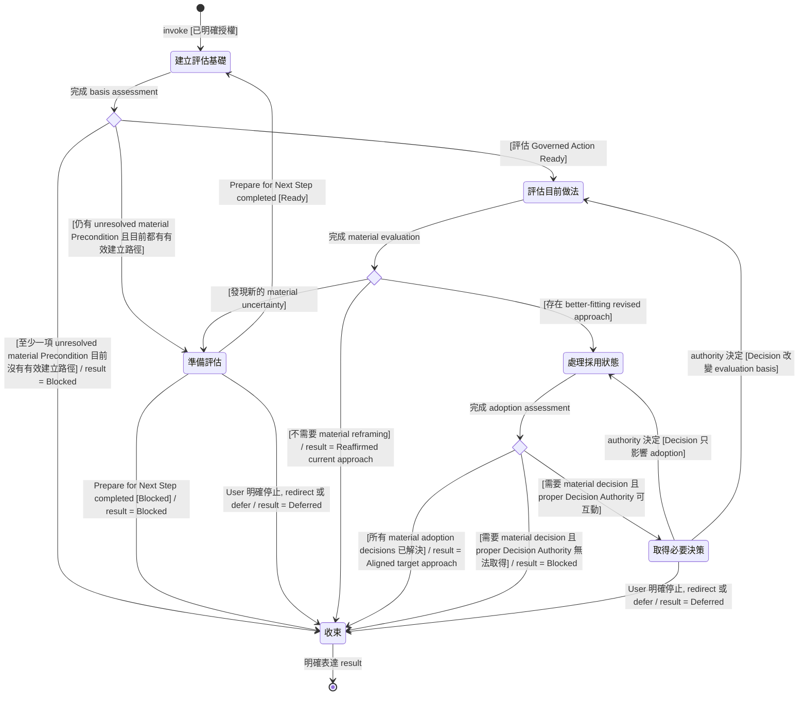

# Reframe the Current Approach

此 Skill 只在明確 invocation 後執行; 不因 code smell, complexity, disagreement, Agent 發現其他方案, 或推測可能適用而自行觸發

以下 state machine 是此 Skill 的 canonical control-flow backbone

## State Machine

## 建立評估基礎

進入 material evaluation 前, 先建立足以可靠進行此次 reframing 的 authoritative basis

此次 Intended Work 是重新評估目前 approach 並判斷是否需要建立不同的 target approach。將 `評估目前做法` 視為 target Governed Action; 相對於這項 action, authoritative problem 應足以符合 `properties/well-specified.md`: 不需要 Agent 以猜測補足會實質改變 evaluation result 的意義, scope, condition 或 allowed choice

從目前可取得的 conversation, 明示來源, 文件與紀錄, settled Decisions, project conventions 與 environment 中辨識 relevant intent 與 expected outcome, requirements 與 invariants, constraints 與 assumptions, observable contracts, required semantic properties, settled Decisions 與其 Decision Authority, 以及此次允許重新考慮的 scope

不要要求特定 process history 才承認 condition 已成立; 判斷所需 current state 是否已經存在即可

若所有 material Preconditions 已成立, `評估目前做法` Ready, 進入該 state

若仍有 unresolved material Precondition, 且目前存在有效建立路徑, 進入 `準備評估`

若至少一項 material Precondition 目前沒有有效建立路徑, 進入 `收束`

## 準備評估

以 `評估目前做法` 為 target Governed Action 使用正式 Skill `Prepare for Next Step`, 只建立可能實質改變 reframing result 的 unresolved material Preconditions

依該 Skill 的 condition-level reasoning 取得所需 authoritative context, 釐清可由現有脈絡支持的 interpretation, 與 applicable authority 互動或取得必要 Decision。優先使用已可取得的 context, 不要求 User 重複提供既有資訊

需要 User 或其他 authority 補足 condition 時, 讓 `Prepare for Next Step` 停留在其 interactive `Establish` state; response 暫停不代表本次 Reframe invocation 已結束

`Prepare for Next Step` 進入 `Ready` 後, 回到 `建立評估基礎`, 重新判斷 evaluation Preconditions; 不因已執行 preparation 就假設 condition 必然仍成立

若 `Prepare for Next Step` 進入 `Blocked`, 進入 `收束`

Recovery loop 只在新的 context, clarification 或 authority input 仍可能實質改變下一次 guard 判斷時繼續。不要因為仍可提出更多問題就無限延長 invocation

## 評估目前做法

以已建立的 authoritative basis 評估 current approach

保留仍具 authority 的 ends, observable contracts, required semantic properties 與 settled Decisions。只重新考慮實際可修改的部分，例如 framing, assumptions, decision procedure, responsibility placement, conclusion placement, maintained intermediate properties, mechanisms, decomposition, seams 與 trade-offs

目前 implementation 維持某項 property, 不代表該 property 本身具有 authority

評估既有 mechanism 或 maintained property 時, 重新確認它在 adjacent mechanisms, downstream semantics 與 existing guarantees 已存在後, 現在仍實際負責什麼工作; 不因它過去曾解決某個問題就預設現在仍應保留

探索足夠 materially distinct 的 alternatives, 以避免只在 current framing 內做 local optimization。只使用與實際問題有關的 reframing perspectives; 移除明顯 dominated alternatives, 只比較會實質區分 viable approaches 的 trade-offs

最後形成 material evaluation:

- 若 current approach 仍然 better-fitting, 或不存在值得採用的 material reframing, 進入 `收束`
- 若存在 coherent, better-fitting revised approach, 進入 `處理採用狀態`
- 若 evaluation 過程暴露新的 material uncertainty, 進入 `準備評估`

## 處理採用狀態

Agent 的 recommendation 不自動授權 recommendation 所隱含的所有 changed Decisions

辨識 revised approach 要成為 current aligned direction 所必須解決的 material adoption decisions。只處理此次 reframing 真正需要的 decision boundary; 不為未來 implementation 漸進展開完整 Decision Dependency Graph

若所有 required material decisions 已由 proper Decision Authority 解決, 進入 `收束`

若仍有 material decision, 而 proper Decision Authority 在目前 interaction 中可取得, 進入 `取得必要決策`

若 proper Decision Authority 目前無法取得, 且因此無法可靠建立 aligned target approach, 進入 `收束`

## 取得必要決策

只向 proper Decision Authority surface 下一個會阻礙 aligned target approach 的最小 material decision

提供足以決策的資訊:

- 必須決定什麼
- Agent 推薦的 choice
- 使這個 decision material 的 decisive rationale 或 trade-off
- 只有在另一個 viable alternative 對 decision 本身有實質意義時才一起呈現

不預設 User 必須閱讀 exhaustive before/after delta, evidence chain, alternative matrix 或 implementation plan 才能決策

Decision Authority 做出決定後, 將該 Decision 視為新的 authoritative current state。若 Decision 只解決 adoption, 回到 `處理採用狀態`; 若 Decision 改變 authoritative problem, constraints, scope 或 allowed solution space, 回到 `評估目前做法`

Proper Decision Authority 可以選擇不同於 Agent recommendation 的方向。此時應依新的 authoritative state 繼續, 不把「authority 決定保留原方向」誤寫成「Agent 評估後 reaffirm 原方向」

## 收束

每次 invocation 必須經由此 state transition 到 final state `[*]`; 只有 `Conclude --> [*]` 才是此 Skill lifecycle 的 end point

只有在以下任一情況成立時進入 `收束`:

- 已建立明確且 coherent 的 target approach
- material continuation condition 已確認無法建立
- User 明確停止, redirect 或 defer 此次 reframing

每次收束只產生一個 result

### Reaffirmed current approach

Agent 的 material evaluation 判斷 current approach 仍然 better-fitting, 或不存在值得採用的 material reframing

只表達足以支持這項 conclusion 的 decisive rationale

### Aligned target approach

已建立 coherent target approach, 且此次 reframing scope 內所有必要 material adoption decisions 均由 proper Decision Authority 解決

Target approach 可能是 Agent recommendation, 也可能反映 Decision Authority 所選擇的其他方向

以 positive target state 表達結果, 使 downstream AI Agent 能直接依此繼續工作

### Blocked

此次 reframing 的 material condition 無法建立, 因此不能可靠完成

明確指出哪個 condition 未成立, 為何目前無法建立, 它如何阻礙 reliable continuation, 以及什麼改變可以使後續 invocation 再次有效進入流程

### Deferred

User 明確停止, redirect 或 defer 仍可繼續的 reframing

保留目前已建立的 material conclusion 與仍未解決的 condition, 使之後重新 invocation 時不需要不必要地重建已知 state

`Reaffirmed current approach` 與 `Aligned target approach` 是 success results; `Blocked` 與 `Deferred` 是合法 terminal results, 但不滿足成功完成的 Postcondition

表達 result 後立即 transition 到 `[*]`; 不讓 Skill 維持隱性的 waiting state

## 互動與揭露

整個 invocation 使用 progressive disclosure

Agent 可以在內部充分比較 current approach 與 alternatives, 但對 User 優先說明 resulting responsibilities, semantics, observable consequences, decisive trade-offs, 以及目前真正需要 User 處理的 material question 或 decision

Supporting evidence 預設作為內部 evaluation basis。只有在 evidence 本身會影響 User decision, 需要它才能解除 material uncertainty, User 明確要求, 或需要回應對 evaluation basis 的 challenge 時才 surface 個別 evidence

不要要求 User 吸收與目前 transition 無關的 exhaustive rationale, alternative matrix, implementation plan 或 downstream implementation decisions

此 Skill 不負責 implementation, 也不負責在 adoption 所需範圍之外逐步探索 downstream Decision Dependency Graph
