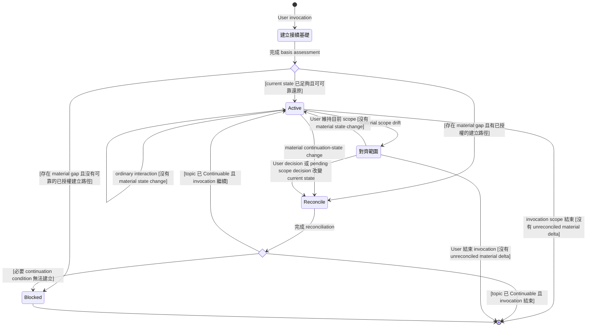

# Continuable

此 Skill 在 User invocation 所界定的 topic 與 scope 內, 作為 surrounding work 的持續性 overlay。它不接管 discussion, research, design, implementation, review 或其他主要工作的責任; 它持續維護 topic 的 current continuation semantics, 使工作在已完成的 interaction boundary 後近乎隨時可以中斷, 並由 applicable `Continuation Basis` 可靠接續

## State Machine



`Active` 是此 Skill 的主要存續狀態。Response 在 `Active`, `Reconcile` 或 `Align Scope` 結束, 不表示 invocation lifecycle 已結束

## 建立接續基礎

先依 User invocation 與目前可取得的脈絡辨識:

- 此次 Continuable invocation 所針對的 topic
- 後續需要支援的 `Intended Work`
- applicable `Continuation Basis`
- 目前需要由該 Basis 承載或還原的 `Continuation State`
- User 已指定的 destination, representation 或其他 materialization action
- 會影響讀取, 更新或還原所需 state 的 authority, capability 與 permission

`Continuation Basis` 是為可靠繼續 Intended Work 需要取得, 依據或具備的 declarative basis。它可以由 repository, issue, document, conversation context, source identity, revision, authority 或其他 material context 共同構成; 不要求任何單一 representation 自成一體

只有在不同 interpretation 會 materially 改變 Intended Work, 所需 Continuation State, recoverability 或允許行動時, 才向 User釐清 topic, scope 或 Basis。不要要求 User 重述目前脈絡已足以可靠建立的內容

依 `Continuation State` semantics 建立目前仍具有 continuation effect 的:

- `Motivation`
- `Established State`
- `Unresolved`

在 material relevant 時保留各項內容的 status, applicable authority 與 material provenance。這些是 semantic coverage, 不是固定 heading, schema 或 serialization format

若目前 Basis 已足以可靠還原所需 current state, 直接進入 `Active`; 不為形式增加新的 representation 或內容

若存在 material continuation gap, 且 User 已授權的 surrounding work 足以建立或 materialize 缺少的 state, 進入 `Reconcile`

若 reliable continuation 需要尚未決定的 destination, write authority, accessible source 或其他 material condition, 明確指出 gap, 提供建議, 並由 User 決定如何建立。不要自行選擇 persistence mechanism, 建立 destination 或取得額外 write authority

## 與主要工作並行

`Continuable` 在 invocation scope 內持續 active, 並與 User 指定的主要工作並行

主要工作仍依其自身 intent, authored behavior, Decision Authority 與結果條件進行。`Continuable` 只處理會影響可靠接續的 current semantics; 不以 continuation concern 取代主要工作的目標, 方法, judgment 或 decision process

當 User 同時要求將 state 寫入 file, GitHub issue 或其他 destination 時, 該 write 或 update 是 surrounding User intent 的一部分。`Continuable` 使用該 destination 與其餘 Continuation Basis 共同建立 recoverability, 但不因此擁有 destination selection 或一般 persistence responsibility

同一個 invocation 可以是短暫的一次性 reconciliation, 也可以跨多輪 interaction 保持 active。差別由 User invocation 的 topic 與 scope 決定, 不形成不同 Skill

## 只在 Material State Change 時 Reconcile

Turn, message, response, tool call, explanation 或 activity 本身都不是 reconciliation trigger

只有當 current continuation-relevant state 發生 material change 時才進入 `Reconcile`

判斷 materiality 時, 使用以下 counterfactual test:

> 若現在不反映這項 change, 新的 continuer 只依 applicable Continuation Basis 接手時, 是否可能 materially 誤解目前工作, 採取已失效或未被允許的方向, 遺漏仍需處理的 matter, 或產生實質不同的行動或結果

若答案為是, 該 change 是 material continuation-state change

可能形成 material change 的情況包括:

- Motivation, intended outcome 或 Intended Work 改變
- scope 或 non-goal 被建立, 修改或取代
- proper authority 建立, 修改或 supersede 一項 Decision
- authoritative fact, assumption, inference 或 validation result 的內容或 status 改變
- 新增 material Unresolved
- Unresolved 被 resolved, blocked, deferred, retired 或改變 resolution status
- applicable authority 或 material provenance 發生會影響後續判斷的變化
- Continuation Basis 所需的 source identity, revision, availability 或 recoverability 改變
- surrounding work 產生新的 result, constraint 或 failure state, 且會影響後續 Intended Work

以下活動本身不構成 material change:

- 對既有 state 的解釋, 重述或舉例
- 尚未形成 current conclusion, Decision, assumption 或 material Unresolved 的 exploratory discussion
- 不影響後續理解或行動的 intermediate reasoning
- tool execution, file inspection 或其他 activity history
- 僅因 response 或 conversation turn 結束

同一個 interaction 內形成的多個 related material deltas 可以合併成一次 reconciliation。Semantic consistency 不要求每個 atomic change 都產生一次 physical write

每個 completed response boundary 都是 consistency checkpoint。若該輪已建立或辨識 material continuation-state change, 在完成 response 前必須:

- 將變化 reconcile 到 applicable Continuation Basis, 或
- 明確進入 `Blocked`, 說明尚未 materialize 的 condition 與原因

不得讓 Agent 已知的 material current-state delta 只存在於 ephemeral reasoning 或尚未反映的 conversation turn 中

若該輪沒有 material state change, 不更新 Continuable representation

## 維護 Current State, 不記錄 History

`Reconcile` 更新的是 current Continuation State projection, 不是 conversation log, event log 或 activity journal

每次 reconciliation 都以目前 applicable state 為準:

```text
previous current state
        +
material semantic delta
        ↓
reconciled current state
```

Reconcile 時:

- 將仍具 continuation effect 的新 state 納入適當 semantic role
- 將 resolved Unresolved 的 material result 移入 `Established State`; 若結果已不再 relevant, 直接 retire
- 移除或取代已失效的 direction, assumption, proposal 或 current-state statement
- 只保留防止恢復失效方向所必要的 supersession fact
- 保留會影響後續判斷的 status, authority 與 provenance
- 不附加每一輪對話, reasoning path, tool activity 或形成 state 的完整過程

尚未成為 current state 的 candidate idea, exploratory alternative 或 intermediate thought, 不因曾在對話中出現就 materialize

`Continuable` 應反映「現在是什麼狀態」, 而不是「一路發生過什麼」

## 以整個 Continuation Basis 判斷 Sufficiency

Continuability 以整個 `Continuation Basis` 判斷, 不以單一 file, issue 或其他 representation 是否 self-contained 判斷

優先使用 Basis 中已可靠承載的 current semantics。只 materialize:

- Basis 中其他來源無法可靠還原的 continuation-relevant semantics
- 雖可從多個來源推導, 但若缺少 explicit projection 就無法可靠接續的 state
- 為辨識 applicable authority, provenance, revision 或 current interpretation 所必要的資訊

不要為了建立看似完整的 handoff 而複製 repository, issue, document 或其他 authoritative mutable source 中已可靠存在的內容

當 mutable source 本身是 authority 時, 優先引用其 identity, revision 或 current location, 而不是建立可能獨立 stale 的 competing snapshot。只有當特定 revision 或 version 對可靠接續具有 material reference semantics 時, 才將它明確納入 Basis

「下一個 Agent 理論上可以重新研究或重新推導」不等於 recoverable。若一項 Decision, governing rationale, scope boundary, assumption status 或 material conclusion 必須重新調查, 猜測或再次決策才能得到, 該 semantics 尚未被可靠承載

Derived summary 或 continuation projection 可以存在, 但應保留足以辨識 authority 與 provenance 的資訊, 避免它被誤認為取代原 authoritative source

## 保持 Scope 對齊

Ordinary tangent 只要仍服務目前 Intended Work, 不需要打斷 User

當 surrounding work 開始 materially 超出目前 topic 或 Intended Work, 並可能改變 scope, Continuation Basis, decision space 或所需 current state 時, 進入 `Align Scope`

向 User 表達:

- 目前正在處理的 topic 與 scope
- 新方向如何偏離, 擴張或 redirect 目前工作
- 若繼續, 會對 Intended Work 或 Continuation State 造成什麼 material 影響
- Agent 推薦的處理方式與 decisive rationale

讓 User 決定是否:

- 維持目前 scope
- 擴張目前 topic
- redirect 目前 topic
- 拆成另一個 topic
- defer 新方向

Agent 應提供 recommendation, 但不替 User 決定會 materially 改變其 intent, scope 或 expected outcome 的方向

User 決定前, 不將候選方向視為 current Motivation, Decision 或 governing scope。若 pending scope decision 本身已會影響可靠接續, 將它以實際 status 保留在 `Unresolved`

若 User 決定拆成另一個 topic, 不將目前 Continuable invocation 自動延伸到新 topic。只有 User 明確將新 topic 納入或另行 invoke 時, 才對該 topic 套用此 Skill

User 決定造成 material state change 後, 進入 `Reconcile`; 若維持原 scope 且沒有 material delta, 回到 `Active`

## 結束與 Blocked

此 Skill 保持 active, 直到:

- User 明確結束或取消 invocation
- 與它組合的 bounded work 結束, 且 invocation scope 不涵蓋後續工作
- User 將工作 redirect 到目前 invocation 之外
- 必要 continuation condition 無法可靠建立

正常結束前, 確認:

- 沒有 Agent 已知但尚未 reconcile 的 material continuation-state delta
- Intended Work 所需的 current Continuation State 沒有 material omission
- 所需 semantics 能從 applicable Continuation Basis 可靠還原
- continuer 不需要猜測會 materially 改變理解, 允許行動或結果的內容

若沒有新的 material delta, 結束時不為形式重寫 representation

由於 material changes 已在 completed response boundary 前 reconcile, 正常處於 `Active` 的 Thread 可以在幾乎任何已完成的 interaction boundary 中斷, 並由新的 Thread 或 continuer 接手; reliability 不依賴 close-time summary 或最後一次 flush

若必要 continuation condition 因缺少 authority, source, capability, destination, permission 或其他 material condition而無法建立, 進入 `Blocked`

`Blocked` 時明確指出:

- 哪個 continuation condition 尚未成立
- 它如何阻礙 reliable continuation
- 為何目前無法建立
- 什麼改變可以使後續 invocation 恢復有效

不得在存在 unreconciled material gap 時宣稱 topic 已 `Continuable`
