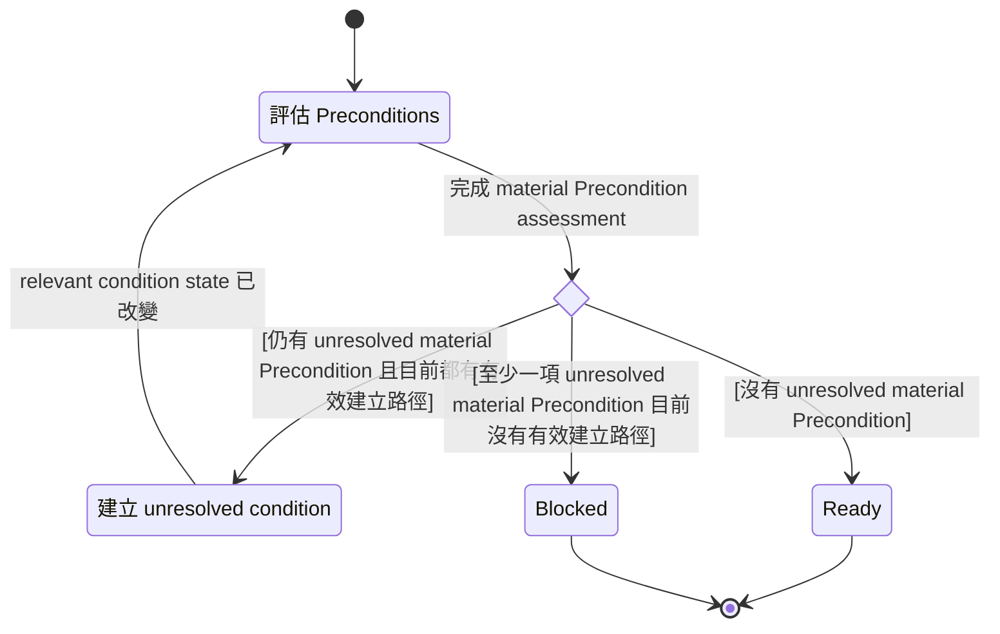

# Prepare for Next Step

Target Governed Action 必須已可辨識。此 Skill 負責使該 action 準備好進入實質執行; 不負責發現, 選擇, 規劃或排列接下來應採取的 action

以下 state machine 是此 Skill 的 canonical control-flow backbone

## State Machine

## 評估 Preconditions

依目前可取得的 authoritative context, 評估 target Governed Action 的 material Preconditions

只有當一項 Precondition 所要求的 current state 已得到足夠支持時, 才視為成立。不得將資訊缺失視為成立; 也不必處理不會約束 Governed Action 進入實質執行的 uncertainty

若沒有 unresolved material Precondition, 進入 `Ready`

若仍有 unresolved material Precondition, 且每一項目前都有有效建立路徑, 進入 `Establish`

若至少一項 unresolved material Precondition 目前沒有可行的建立路徑, 進入 `Blocked`

## 建立 unresolved condition

只建立使 target Governed Action Ready 所必要的 unresolved material conditions

依實際 condition 選擇適合的建立方式, 例如取得相關 authoritative context, 依現有脈絡解決可被支持的 interpretation, 從 applicable Decision Authority 取得必要 Decision, 與 User 或其他可取得的 authority 互動, 取得必要 resource 或 capability, 觀察相關 environmental state, 或組合 authored meaning 能建立或釐清該 condition 的正式 Skill

不要使用固定 resolution sequence; 從實際 unresolved condition 決定所需行動

需要互動時, 只提出建立該 condition 所必要的資訊或 material choice。當可取得的 authority 尚未提供必要資訊或 Decision 時, 仍處於 `Establish`; response 可以在此 state 暫停, 但 Skill lifecycle 尚未結束

不得將 assumption 提升為 authoritative fact 或 Decision。只有當 target Governed Action 的 governing meaning 明確允許在該 assumption 下繼續時, assumption 才能支援 readiness; assumption 本身仍維持 assumption status

當 relevant condition state 改變後, 回到 `Evaluate`。若建立過程只確認某項 condition 已無有效建立路徑, 這也是 relevant condition state 的改變; 回到 `Evaluate` 後由 guard 進入 `Blocked`

## Ready

`Ready` 是成功的 terminal state

只有當 target Governed Action 在進入實質執行前所需的所有 material Preconditions 都已成立, 且不需要猜測會實質改變其意義或結果的內容時, 才進入 `Ready`

Unknowns, alternatives 或 deferred details 若不約束 Governed Action 的進入, 或 governing meaning 已明確允許其保持 open, 不妨礙進入 `Ready`

進入 `Ready` 後, 此 Skill 完成; control 可回到 target Governed Action

## Blocked

`Blocked` 是非成功的 terminal state

只有當至少一項 unresolved material Precondition 已確認目前沒有有效建立路徑時, 才進入 `Blocked`

結束前明確指出:

- 尚未成立的 material Precondition
- 目前沒有有效建立路徑的原因
- 已知可使 Governed Action 解除阻礙的有效路徑, 若存在

不得將 target Governed Action 描述為 Ready 或已成功準備完成

進入 `Blocked` 後, 此 Skill 完成
